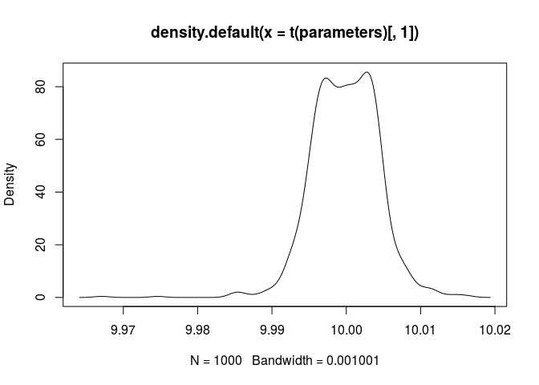
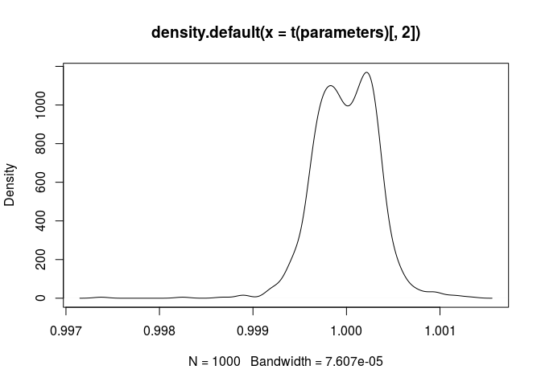

<!-- README.md is generated from README.Rmd. Please edit that file -->
bayestools
==========

Overview
--------

An R package for pre- and post-processing in phylogenetic and divergence-times bayesian inference. You can use it for processing output of phylogenetic bayesian programs (such as [Beast](https://www.beast2.org/) or [MrBayes](http://nbisweden.github.io/MrBayes/index.html)) or to prepare input files and decision making. It also supports sensitivity calculations using intersection (Ballen, in prep.) for comparing two given densities (e.g. prior vs. posterior).

Installation
------------

For now only the github development version is available. You can install it using `devtools`:

``` r
install.packages("devtools")
devtools::install_github("gaballench/bayestools")
```

Once the package makes its way into CRAN the standard `install.packages` may be used for installing stable versions.

Problems?
---------

If you find a bug or unexpected behavior, please [file an issue](https://github.com/gaballench/bayestools/issues).

Implementation and miscelaneous notes
-------------------------------------

### Why to use the median of quantiles as starting values?

on the initial values... the following code will generate a lot of parameter estimates from several trials using different initial values. With a bit of large number theory, a decent estimate can be found. Here, q and p are quantile and probabilities under a given distribution, a different anonymous function where sapply varies the values of the initial values allows to get the $par element of the optim call, and the the density plot shows that overall a median estimate approaches at the correct value. The values of q come from qDIST given the probabilities of interest (generally 0.05, 0.5, and 0.95). For instance: qbeta(p = c(0.05, 0.5, 0.95), shape1 = 10, shape2 = 1) for the example below:

``` r
# X = seq... is the set of values to try, from min(q) to max(q). 
parameters <- sapply(X = seq(0.7411344, 0.9948838, length.out = 1000),
                     FUN = function(x) {
                         findParams(q = c(0.7411344, 0.9330330, 0.9948838),
                                    p = c(0.05, 0.5, 0.95),
                                    densit = "pbeta",
                                    params = c("shape1", "shape2"),
                                    initVals = c(x, x))$par
                     },
                     simplify = TRUE)

plot(density(t(parameters)[, 1]))
```



``` r
plot(density(t(parameters)[, 2]))
```


